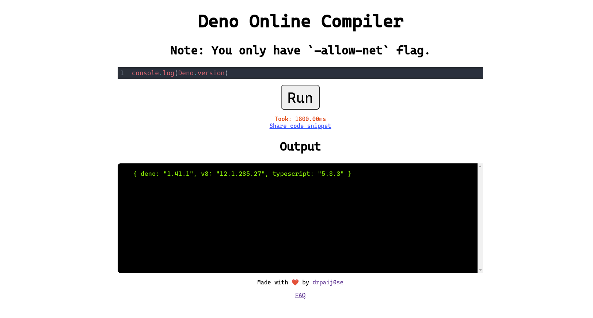

# Deno Online Compiler

# About

Welcome to Deno Online Compiler! Here, you can write and run your Deno code snippets hassle-free. Deno, the secure runtime for JavaScript and TypeScript, offers a convenient environment for building scalable server-side and command-line applications.

With this editor, you can unleash the power of Deno's latest version, ensuring you have access to all the newest features and improvements. Whether you're a seasoned Deno developer or just getting started, our intuitive interface makes it easy to write, test, and debug your code.

Key features of our Deno code editor include:

1. **Syntax Highlighting:** Enjoy syntax highlighting that makes your code easily readable and navigable.

2. **Code Execution:** Run your Deno code snippets directly within the editor, eliminating the need for separate setups or environments.

3. **Output Display:** View the output of your code execution within the editor itself, allowing for quick feedback and debugging.

4. **Code Sharing:** Easily share your Deno code snippets with others by generating shareable links.

Whether you're experimenting with Deno's capabilities, prototyping a new project, or refining existing code, our Deno code editor provides a seamless development experience. Dive in and start coding with confidence!
